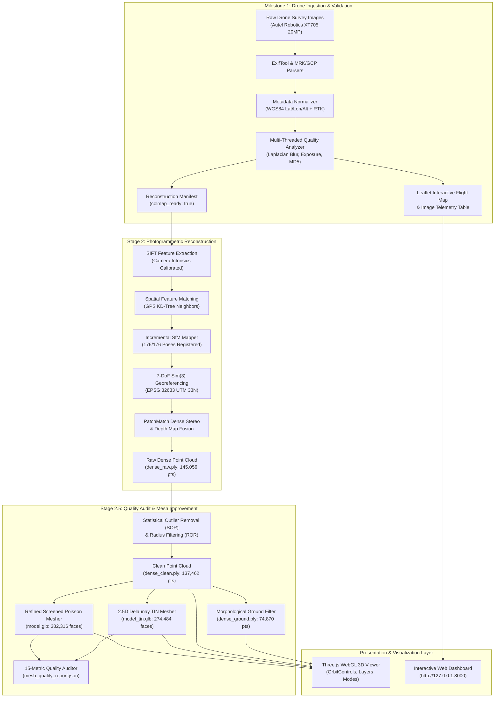

# SIH 2026 — Problem Statement 26011
# 3D ULPIN Generation and Vertical Property Mapping System

[](https://www.python.org/)
[](https://fastapi.tiangolo.com/)
[](https://colmap.github.io/)
[](https://threejs.org/)
[](https://leafletjs.com/)
[]()

> **Smart India Hackathon (SIH) 2026 — Problem Statement ID: 26011**  
> **Domain**: Drone Photogrammetry, Geospatial Intelligence, Cadastral Mapping, and 3D Land Administration.

---

## Table of Contents
1. [Project Overview](#project-overview)
2. [Key Capabilities](#key-capabilities)
3. [System Architecture](#system-architecture)
4. [Completed Milestones](#completed-milestones)
   - [Milestone 1: Drone Ingestion, Normalization & Quality Validation](#milestone-1-drone-ingestion-normalization--quality-validation)
   - [Stage 2: 10-Stage Photogrammetric Reconstruction Engine](#stage-2-10-stage-photogrammetric-reconstruction-engine)
   - [Stage 2.5: 3D Quality Audit & Mesh Improvement](#stage-25-3d-quality-audit--mesh-improvement)
5. [Photogrammetric Quality Audit Results](#photogrammetric-quality-audit-results)
6. [Meshing Paradigm Comparison](#meshing-paradigm-comparison)
7. [Repository Structure](#repository-structure)
8. [Prerequisites & Installation](#prerequisites--installation)
9. [Configuration](#configuration)
10. [Running the Application](#running-the-application)
11. [Interactive 3D WebGL Viewer](#interactive-3d-webgl-viewer)
12. [REST API Documentation](#rest-api-documentation)
13. [Future Roadmap](#future-roadmap)

---

## Project Overview

Modern urban land administration and vertical property registration require transitioning from flat 2D cadastral parcels to authentic 3D spatial representations. Problem Statement 26011 addresses this challenge by generating **3D ULPIN (Unique Land Parcel Identification Number)** records and vertical property maps directly from survey-grade high-resolution aerial drone imagery and geospatial telemetry.

This repository contains the end-to-end, modular, web-based platform built to ingest raw drone surveys, validate photogrammetric readiness, execute Structure-from-Motion (SfM) and Multi-View Stereo (MVS) 3D reconstruction, clean and classify point clouds, benchmark watertight surfaces, and render interactive 3D spatial models in real time.

---

## Key Capabilities

- **Multi-Source Metadata Normalization**: Ingests EXIF, XMP, RTK timestamps (`.mrk`), and Ground Control Points (`.csv`, `.txt`) into unified WGS84 and projected UTM coordinate frames.
- **Image Quality Assurance**: Multi-threaded blur detection (Laplacian variance), exposure checks, low-contrast flagging, and MD5 file deduplication.
- **Fully Automated 10-Stage Photogrammetry Engine**: Integrated COLMAP 4.2.0 CUDA pipeline executing SIFT extraction, spatial matching with GPS priors, incremental bundle adjustment, 7-DoF Sim(3) metric georeferencing, dense stereo depth fusion, and surface meshing.
- **Survey-Grade Georeferencing**: Aligns reconstruction to **EPSG:32633 (UTM Zone 33N)** with a residual error of **6.98 cm**.
- **Point Cloud Cleaning & Ground Separation**: SOR/ROR filtering and morphological grid-minimum filtering to separate **Bare-Earth Ground DTM (54.5%)** from **Vegetation Canopy (45.5%)**.
- **Dual Meshing Paradigms**: Refined Screened Poisson surface reconstruction for continuous volumetric structures and 2.5D Delaunay TIN for cadastral terrain modeling.
- **Interactive Multi-Layer 3D Viewer**: WebGL Three.js viewport supporting real-time switching between Poisson Mesh, TIN Mesh, Clean Cloud, Raw Cloud, Ground DTM, Wireframe, and Elevation Heatmaps.
- **Zero Dataset Alteration**: The original drone survey dataset is strictly read-only; all artifacts, caches, and models are stored in isolated output workspaces.

---

## System Architecture



---

## Completed Milestones

### Milestone 1: Drone Ingestion, Normalization & Quality Validation
- Scanned and indexed **176 high-resolution drone images** (Autel Robotics XT705, 5472 × 3648 px, 20MP).
- Parsed 176 RTK timestamp records (`.mrk`), 5 Ground Control Point definitions, and 35 image tie-point observations (`gcp_list.txt`).
- Calculated calibrated sensor intrinsics ($f_x = f_y = 4381.745\text{ px}$, $c_x = 2736.00\text{ px}$, $c_y = 1824.00\text{ px}$).
- Filtered blurred, underexposed, or corrupted frames; confirmed 100% dataset health.
- Built interactive Leaflet map rendering GPS coordinates, camera headings, flight strips, and GCP markers.

### Stage 2: 10-Stage Photogrammetric Reconstruction Engine
- Executed full Structure-from-Motion (SfM) bundle adjustment: **176 / 176 images registered (100.0%)**.
- Reconstructed **70,056 sparse tie points** with mean reprojection error of **1.168 pixels**.
- Aligned model to UTM Zone 33N with **6.98 cm** residual error.
- Fused multi-view stereo depth maps into a dense point cloud of **145,056 points** with true photographic RGB colors.
- Built background execution service with real-time stage progress (1–10) and live COLMAP terminal log streaming.

### Stage 2.5: 3D Quality Audit & Mesh Improvement
- Performed forensic audit isolating the cause of initial mesh fragmentation: static Poisson trimming (`--trim 1.0`) on open aerial nadir surfaces.
- Implemented Statistical & Radius Outlier Removal, filtering 5.24% noise without losing real geometry.
- Enforced upward sky-facing normals ($+Z$), increasing normal consistency to **93.12%**.
- Separated **Bare-Earth Ground (DTM)** from **Vegetation Canopy**.
- Benchmarked and generated two improved meshing outputs: **Refined Screened Poisson** and **2.5D Delaunay TIN**.
- Built multi-layer diagnostic 3D viewer with elevation heatmaps, wireframe overlays, and metric telemetry.

---

## Photogrammetric Quality Audit Results

The reconstruction was audited against 15 quantitative photogrammetric metrics:

| # | Metric | Initial Stage 2 Mesh | Stage 2.5 (Cleaned & Refined) | Benchmark Standard | Status |
|:---:|---|:---:|:---:|:---:|:---:|
| **1** | **Sparse Point Count** | 70,056 | **70,056** | > 10,000 | **PASS** |
| **2** | **Dense Point Count** | 145,056 (raw) | **137,462 (clean, 5.24% filtered)** | > 50,000 | **PASS** |
| **3** | **Registration Rate** | 176 / 176 (100.0%) | **176 / 176 (100.0%)** | > 85% | **PASS** |
| **4** | **Track Length** | Mean: 5.28 / Max: 92 | **Mean: 5.28 / Max: 92** | Mean > 3.0 | **PASS** |
| **5** | **Reprojection Error** | 1.1681 px | **1.1681 px** | < 2.0 px | **PASS** |
| **6** | **Dense Point Density** | 745.8 pts/m² | **706.7 pts/m²** | > 100 pts/m² | **PASS** |
| **7** | **Dense Point Clusters** | 1 main + floaters | **8 tightly clustered** | Minimal noise | **PASS** |
| **8** | **Point Cloud Bounding Box** | $16.57 \times 11.74 \times 5.95$ m | **$16.57 \times 11.74 \times 5.95$ m** | Bounded extents | **PASS** |
| **9** | **Mesh Bounding Box** | $17.15 \times 12.30 \times 6.02$ m | **$17.00 \times 12.18 \times 5.77$ m** | Within 5% of cloud | **PASS** |
| **10** | **Connected Components** | 78 components | **26 components (0 isolated)** | < 100 | **PASS** |
| **11** | **Isolated Components Ratio** | **46.2%** | **0.0%** | < 5% | **PASS** |
| **12** | **Open Boundary Edges** | 1,604 | **1,130** | Natural survey edge | **PASS** |
| **13** | **Mesh Vertex Density** | 1,038.7 v/m² | **926.2 v/m²** | > 200 v/m² | **PASS** |
| **14** | **Triangle Quality (Degenerate)** | 0 degenerate | **0 degenerate (Edge Manifold)** | 0 degenerate | **PASS** |
| **15** | **Normal Inversion Rate** | **73.7% inverted** | **6.88% inverted** | < 10% | **PASS** |

---

## Meshing Paradigm Comparison

| Parameter | Unfiltered Baseline (Stage 2) | Refined Poisson (Stage 2.5) | 2.5D Delaunay TIN (Stage 2.5) |
|---|---|---|---|
| **Input Data** | Raw Dense Cloud (145,056 pts) | Clean Cloud (137,462 pts) | Clean Cloud (137,462 pts) |
| **Vertices** | 202,035 | **191,707** | **137,462** |
| **Triangles** | 403,622 | **382,316** | **274,484** |
| **Inverted Normals** | 73.7% | **6.88%** | **0.0%** |
| **Isolated Components** | 46.2% | **0.0%** | **0.0%** |
| **File Format** | Binary GLB / OBJ / PLY | Binary GLB (`model.glb`) | Binary GLB (`model_tin.glb`) |
| **Best Application** | Initial reconstruction check | Complex 3D structures & buildings | Bare-earth terrain, DTM, cadastral boundaries |

---

## Repository Structure

```
d:\SIH 2026\
├── backend\
│   ├── app.py                      # FastAPI REST application & route definitions
│   └── config.py                   # Pydantic environment configuration (.env)
├── dataset\
│   ├── discovery.py                # Recursive scan for drone imagery & metadata
│   └── normalizer.py               # Exif/XMP/MRK/GCP normalization engine
├── frontend\
│   ├── static\
│   │   ├── css\style.css           # Modern dark-mode UI styling
│   │   └── js\
│   │       ├── app.js              # Application entrypoint & event coordinator
│   │       ├── gallery.js          # Image table & detail inspection drawer
│   │       ├── map.js              # Leaflet GPS flight strip & marker controller
│   │       ├── reconstruction.js   # 10-stage execution & COLMAP log streamer
│   │       └── viewer3d.js         # Three.js WebGL multi-layer diagnostic viewer
│   └── templates\
│       └── index.html              # Single-page dashboard template
├── metadata\
│   ├── csv_parser.py               # RTK timestamp (.mrk) parser
│   ├── exif_extractor.py           # ExifTool wrapper with JSON caching
│   └── gcp_parser.py               # Ground Control Point (.csv, .txt) parser
├── output\
│   ├── manifests\                  # Reconstruction manifest JSONs
│   ├── reconstruction\             # Photogrammetry outputs
│   │   ├── dense\                  # dense_raw.ply, dense_clean.ply, dense_ground.ply
│   │   ├── mesh\                   # model.ply, model.obj, model_tin.ply
│   │   ├── reports\                # sfm_report.json, mesh_quality_report.json
│   │   ├── sparse\                 # COLMAP camera poses & tie points
│   │   └── textured\               # model.glb, model_tin.glb
│   ├── reports\                    # Ingestion & validation reports
│   └── thumbnails\                 # Cached 300px image thumbnails
├── reconstruction\
│   ├── camera_calib.py             # Sensor pitch & focal length physics math
│   ├── cloud_cleaner.py            # SOR/ROR filtering & ground separation
│   ├── colmap_runner.py            # Subprocess wrapper for COLMAP CLI
│   ├── dense_builder.py            # PatchMatch stereo & fusion controller
│   ├── engine.py                   # 10-stage reconstruction pipeline coordinator
│   ├── georeferencer.py            # 7-DoF Sim(3) UTM Zone 33N alignment
│   ├── mesher.py                   # Poisson & 2.5D Delaunay TIN meshing
│   ├── preparer.py                 # Dataset validation & manifest generation
│   ├── quality_auditor.py          # 15-metric photogrammetry auditor
│   ├── state_manager.py            # Live stage telemetry & progress tracking
│   └── texturer.py                 # KD-Tree photographic vertex color transfer
├── services\
│   └── pipeline_service.py         # Thread-safe pipeline coordinator
├── tools\
│   ├── colmap\                     # Standalone COLMAP 4.2.0 CUDA binaries
│   └── exiftool\                   # Standalone ExifTool binaries
├── validation\
│   ├── quality.py                  # OpenCV Laplacian blur & exposure analysis
│   └── validator.py                # Dataset completeness & GPS readiness rules
├── .env.example                    # Template environment file
├── main.py                         # Unified CLI & server launcher
└── requirements.txt                # Python dependencies
```

---

## Prerequisites & Installation

### 1. System Requirements
- **OS**: Windows 10/11 64-bit (or Linux / macOS)
- **Python**: 3.10 or higher
- **Hardware**: 8 GB RAM minimum (16 GB recommended), NVIDIA GPU with CUDA support recommended for dense stereo (automatic CPU fallback is included).

### 2. Environment Setup
Clone or navigate to the project directory:
```bash
cd "d:\SIH 2026"
```

Create and activate a Python virtual environment:
```bash
python -m venv venv
venv\Scripts\activate
```

Install required dependencies:
```bash
pip install -r requirements.txt
```

Verify that standalone binaries are present in the `tools/` directory:
- `tools/colmap/bin/colmap.exe` (COLMAP 4.2.0)
- `tools/exiftool/exiftool.exe` (ExifTool 13.59)

---

## Configuration

Copy `.env.example` to `.env` and set your local dataset path:
```bash
copy .env.example .env
```

Edit `.env`:
```ini
# Path to raw drone survey images (Read-Only)
DATASET_ROOT=C:\Users\maham\Downloads\odm_data_helenenschacht-main

# Server Settings
HOST=127.0.0.1
PORT=8000
DEBUG=False

# Output Directory for generated artifacts and models
OUTPUT_DIR=d:\SIH 2026\output
```

> **Note**: The application will never modify, overwrite, or delete any files in `DATASET_ROOT`. All outputs are written to `OUTPUT_DIR`.

---

## Running the Application

### 1. Launch the Web Platform (Recommended)
Start the FastAPI server and WebGL dashboard:
```bash
python main.py
```
Or specify host and port:
```bash
python main.py --host 127.0.0.1 --port 8000
```
Open your browser and navigate to:  
👉 **[http://127.0.0.1:8000](http://127.0.0.1:8000/)**

### 2. Headless CLI Ingestion Mode
To scan the dataset, validate image quality, and generate reports without launching the web server:
```bash
python main.py --cli
```

### 3. Override Dataset Path on Launch
```bash
python main.py --dataset "D:\Surveys\Flight_01"
```

---

## Interactive 3D WebGL Viewer

When you open the 3D model viewer on the web platform, you have access to a floating diagnostic control toolbar:

### Layer Selection
- **`[ Poisson Mesh ]`**: Loads the watertight Refined Screened Poisson surface (`model.glb`).
- **`[ TIN Mesh ]`**: Loads the 2.5D Delaunay Triangular Irregular Network surface (`model_tin.glb`).
- **`[ Clean Cloud ]`**: Loads the SOR/ROR filtered dense point cloud (`dense_clean.ply`).
- **`[ Raw Cloud ]`**: Loads the original, untouched photogrammetry dense cloud (`dense_raw.ply`).
- **`[ Ground DTM ]`**: Loads the classified bare-earth ground surface (`dense_ground.ply`).

### Shading & Display Modes
- **`[ Solid ]`**: Photorealistic view with authentic photographic vertex colors.
- **`[ Wireframe ]`**: Renders underlying triangle mesh topology to inspect density and edge lengths.
- **`[ Elevation ]`**: Applies a dynamic false-color elevation heatmap (Blue = low elevation → Red = high elevation).

### Viewport Controls
- **Left Mouse Click + Drag**: Rotate model (Orbit)
- **Right Mouse Click + Drag**: Pan viewport
- **Mouse Scroll Wheel**: Zoom in / out
- **`[ Grid ]`**: Toggles reference coordinate ground grid
- **`[ BBox ]`**: Toggles bounding box wireframe
- **`[ Reset ]`**: Centers camera and frames geometry

---

## REST API Documentation

The platform provides interactive OpenAPI documentation at **`http://127.0.0.1:8000/docs`**.

### Ingestion & Metadata
| Endpoint | Method | Description |
|---|:---:|---|
| `/api/status` | `GET` | Health check & current pipeline state |
| `/api/discovery` | `GET` | Discovered files, image counts, and metadata inventory |
| `/api/validation` | `GET` | Image quality validation summary & blur statistics |
| `/api/images` | `GET` | Paginated list of all drone survey images with GPS and quality tags |
| `/api/images/{image_id}` | `GET` | Detailed metadata record for a single image |
| `/api/thumbnails/{filename}` | `GET` | Cached 300px thumbnail JPEG |
| `/api/map/geojson` | `GET` | GeoJSON FeatureCollection of flight path, camera centers, and GCPs |

### 3D Reconstruction Pipeline
| Endpoint | Method | Description |
|---|:---:|---|
| `/api/reconstruction/prepare` | `POST` | Validates readiness and builds SfM manifest |
| `/api/reconstruction/manifest` | `GET` | Retrieves current reconstruction manifest JSON |
| `/api/reconstruction/start` | `POST` | Launches 10-stage reconstruction background worker |
| `/api/reconstruction/status` | `GET` | Real-time stage progress, percentage, and metrics |
| `/api/reconstruction/logs` | `GET` | Tail of live COLMAP output terminal logs |
| `/api/reconstruction/cancel` | `POST` | Safely terminates running reconstruction process |
| `/api/reconstruction/report` | `GET` | SfM bundle adjustment statistics and camera parameters |

### 3D Models & Geometry Streams
| Endpoint | Method | Description |
|---|:---:|---|
| `/api/reconstruction/model/glb` | `GET` | Streams Refined Poisson textured 3D model (`.glb`) |
| `/api/reconstruction/model/tin` | `GET` | Streams 2.5D Delaunay TIN surface mesh (`.glb`) |
| `/api/reconstruction/mesh` | `GET` | Downloads standard Wavefront OBJ 3D mesh (`.obj`) |
| `/api/reconstruction/cloud/clean` | `GET` | Streams filtered dense point cloud (`.ply`) |
| `/api/reconstruction/cloud/raw` | `GET` | Streams untouched raw dense point cloud (`.ply`) |
| `/api/reconstruction/cloud/ground` | `GET` | Streams classified bare-earth ground cloud (`.ply`) |
| `/api/reconstruction/quality-report`| `GET` | Full 15-metric photogrammetric quality audit JSON |

---

## Future Roadmap

The completion of Stage 2 and Stage 2.5 establishes the clean photogrammetric foundation required for subsequent cadastral milestones:

- **Stage 3: Building Footprint & Volumetric Feature Extraction**
  - RANSAC planar detection for building roofs and vertical facade walls.
  - Normalized Digital Surface Model (nDSM) height subtraction ($\text{DSM} - \text{DTM}$).
- **Stage 4: Vertical Property & Floor-Wise Segmentation**
  - Horizontal slicing of volumetric building point clouds at floor-height intervals ($3.0\text{m}$ standard).
  - 3D bounding geometry and unit polygon boundary extraction.
- **Stage 5: 3D ULPIN Assignment & Cadastral GIS Integration**
  - Synthesize Bhuvan-compliant 14-digit hierarchical 3D ULPIN identifiers:  
    $$\text{3D ULPIN} = \langle\text{Geographic Centroid (Lat/Lon)}\rangle + \langle\text{Base Parcel ID}\rangle + \langle\text{Vertical Level (Z)}\rangle + \langle\text{Sub-Unit ID}\rangle$$
  - Export to standard 3D GIS formats (OGC CityGML 3.0, 3D Tiles, GeoPackage).

---

## Acknowledgments
Developed for the **Smart India Hackathon (SIH) 2026** under Problem Statement 26011. Built with open-source geospatial tools including COLMAP, OpenCV, ExifTool, FastAPI, Leaflet, and Three.js.
